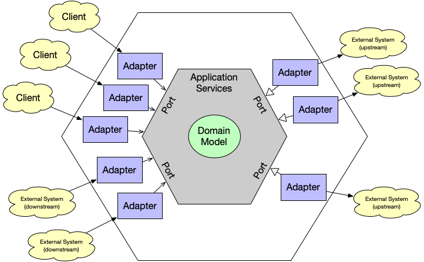

# Domain-Driven Design and Hexagonal Architecture Spring Boot Template




## Getting Started


### Prerequisites

- Java 17 or later
- Maven 3.8 or later
- Docker (for containerization)
- Docker Compose (for managing multi-container Docker applications)

### Build and Run

1. **Clone the Repository**

2. **Build the Maven Project**

```bash
mvn clean install
```

3. **Build and Run with Docker Compose**

```bash
docker-compose up --build
```

### Postman Collection

The Postman collection for testing the API is located in the `docs` directory:

- **File**: `docs/postman_collection.json`

You can import this collection into Postman to run and test the API endpoints.